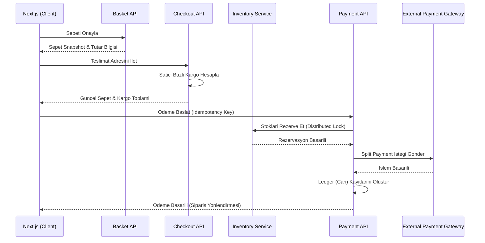

# OmniCommerce.Engine

## Proje Hakkinda
OmniCommerce.Engine, modern e-ticaret ve pazar yeri (Marketplace) gereksinimlerini karşılamak üzere tasarlanmış, yüksek performanslı ve ölçeklenebilir bir ticaret motorudur. Monolitik mimarinin getirdiği bağımlılık darboğazlarını aşmak amacıyla Dikey Dilim Mimarisi (Vertical Slice Architecture) temel alınarak geliştirilmiştir.

Sistem, bir ürünün hem markanın kendi kanallarında (Mono-brand) hem de genel pazar yerinde (Multi-brand) aynı anda farklı dinamiklerle (fiyat, stok, kargo baremi) listelenebilmesine olanak tanır.

## Temel Mimari Prensipler

1. Vertical Slice Architecture: Her bir iş gereksinimi (Feature), kendi veritabanı sorgularını, iş kurallarını ve API uç noktalarını izole bir şekilde barındırır.
2. CQRS Pattern: MediatR kullanılarak okuma (Query) ve yazma (Command) operasyonları birbirinden kesin çizgilerle ayrılmıştır.
3. Multi-Tenancy (Kanal İzolasyonu): Tek veritabanı üzerinde EF Core Global Query Filters kullanılarak veri sızıntıları donanımsal düzeyde engellenmiştir.
4. Split Payment Integration: Ödeme anında satıcı hak edişleri ve platform komisyonları anında bölüştürülür, merkezi havuz (Payout) riskleri ortadan kaldırılır.

## Teknoloji Yigini

Backend Katmani
- Framework: .NET 9
- Mimari: Vertical Slice & CQRS
- Veri Erisimi: Entity Framework Core
- Asenkron Iletisim: MassTransit (RabbitMQ)
- Onbellekleme: Redis (In-Memory Basket Management)
- Dagitik Kilit: Redlock (Stok Rezervasyonu)

Frontend Katmani
- Framework: Next.js 16 (App Router)
- State Management (Server): React Server Components (RSC) + Native Fetch Memoization
- State Management (Client): Zustand
- Data Fetching: TanStack Query (React Query)
- Styling: CSS Modules + CSS Variables (Data-Theme attribute tabanli)

## Moduller ve Akislar

### 1. Basket & Checkout Modulu
Kullanicinin sepet deneyimini yoneten hizli ve gecici (ephemeral) veri yonetim katmanidir.
- Redis uzerinde session tabanli sepet yonetimi.
- Next.js uzerinden Zustand ile anlik sepet senkronizasyonu.
- Adres degisikliklerinde satici (Merchant) bazli dinamik kargo maliyeti hesaplama.

### 2. Payment & Ledger Modulu
Finansal tutarliligin ve ACID prensiplerinin uygulandigi kritik katmandir.
- Odeme oncesi Envanter servisinden anlik Availability Check (Stok Dogrulama).
- Idempotency-Key ile mukerrer odeme korumasi.
- Basarili odeme sonrasi Event-Driven mimari ile asenkron siparis olusturma (Order Saga).

## Mimari Cizimler

### Checkout ve Odeme Akisi

Kurulum ve Calistirma
Projenin yerel gelistirme ortaminda calistirilabilmesi icin Docker gereklidir.

Repoyu klonlayin:
git clone https://www.google.com/search?q=https://github.com/yourusername/OmniCommerce.Engine.git

Gerekli altyapi servislerini (SQL Server, Redis, RabbitMQ) ayaga kaldirin:
docker-compose up -d

Entity Framework migration islemlerini uygulayin:
dotnet ef database update --project src/OmniCommerce.Infrastructure

Projeyi baslatin:
dotnet run --project src/OmniCommerce.Api

Lisans
Bu proje MIT Lisansi ile lisanslanmistir. Daha fazla bilgi icin LICENSE dosyasina bakiniz.
